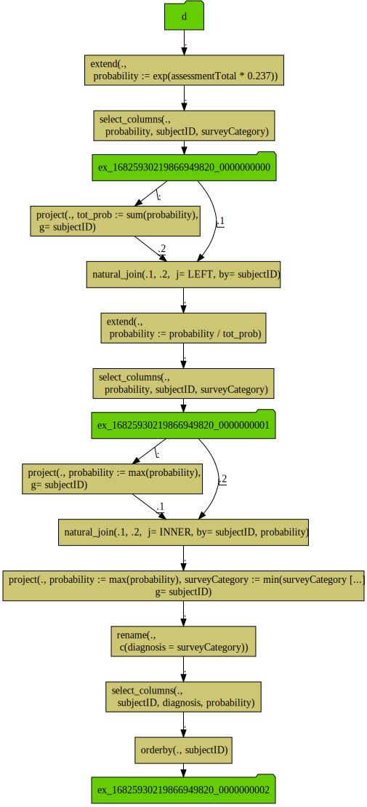

Let's work a non-trivial example: the `dplyr` pipeline from [Let’s Have Some Sympathy For The Part-time R User](http://www.win-vector.com/blog/2017/08/lets-have-some-sympathy-for-the-part-time-r-user/).

For `RSQlite` this is going to be a mess, as we do not have window functions and self-joins can be problematic in `RSQlite`.

``` r
library("rquery")
library("wrapr")

raw_connection <- DBI::dbConnect(RSQLite::SQLite(), ":memory:")
RSQLite::initExtension(raw_connection)
db <- rquery_db_info(
  connection = raw_connection,
  is_dbi = TRUE,
  connection_options = rq_connection_tests(raw_connection))
tree_rewriter <- function(x, db_info) {
  if(("pre_sql_sub_expr" %in% class(x)) && 
     (length(x$info$name) == 1) &&
     (x$info$name == "modulo")) {
    lhs <- x$toks[[3]]
    rhs <- x$toks[[5]]
    return(pre_sql_sub_expr(
      list(pre_sql_token("("),
           lhs,
           pre_sql_token("%"),
           rhs,
           pre_sql_token(")")),
      info=list(name = "user_replaced"))
    )
  }
  x
}
# attach our tree-rewriter to the databse handle.
# this handle now uses this re-writer.
db$tree_rewriter <- tree_rewriter

tmps <- mk_tmp_name_source("ex")


# copy data in so we have an example
d_local <- build_frame(
   "subjectID", "surveyCategory"     , "assessmentTotal", "irrelevantCol1", "irrelevantCol2" |
   1L         , "withdrawal behavior", 5                , "irrel1"        , "irrel2"         |
   1L         , "positive re-framing", 2                , "irrel1"        , "irrel2"         |
   2L         , "withdrawal behavior", 3                , "irrel1"        , "irrel2"         |
   2L         , "positive re-framing", 4                , "irrel1"        , "irrel2"         )
rq_copy_to(db, 'd',
            d_local,
            temporary = TRUE, 
            overwrite = TRUE)
```

    ## [1] "table(`d`; subjectID, surveyCategory, assessmentTotal, irrelevantCol1, irrelevantCol2)"

``` r
# produce a hande to existing table
d <- db_td(db, "d")
```

``` r
collector <- make_relop_list(tmps)

scale <- 0.237

# convert assessmentTotal to unscaled proabilities
dqp <- d %.>%
  extend(.,
         probability :=
           exp(assessmentTotal * scale)) %.>%
  collector

# total the probabilities per-group
dqs <- dqp %.>%
  project(., 
          tot_prob := sum(probability),
          groupby = 'subjectID') # could add a collector here to
                                 # to avoid a self-join if RSQlite
                                 # has a problem with that

# join total back in and scale
dqx <- natural_join(dqp, dqs,
                    by = 'subjectID',
                    jointype = 'LEFT') %.>%
  extend(., 
         probability := probability/tot_prob) %.>%
  collector

# find largest per subject probability
mp <- dqx %.>%
  project(., 
          probability := max(probability),
          groupby = 'subjectID') # could add a collector here to
                                 # to avoid a self-join if RSQlite
                                 # has a problem with that

# join in by best score and probability per subject 
# (to break ties)
# and finish the scoring as before
natural_join(mp, dqx,
                   by = c("subjectID", "probability")) %.>%
  project(., 
          probability := max(probability), # pseudo aggregator
          surveyCategory := min(surveyCategory),
          groupby = 'subjectID') %.>%
  rename_columns(., 'diagnosis' := 'surveyCategory') %.>%
  select_columns(., c('subjectID', 
                      'diagnosis', 
                      'probability')) %.>%
  orderby(., cols = 'subjectID') %.>% 
  collector
```

    ## [1] "table(ex_47818072688998837753_0000000002; subjectID, diagnosis, probability)"

We then build our result.

``` r
result <- collector %.>% db
```

And take a look.

``` r
class(result)
```

    ## [1] "relop_table_source" "relop"

``` r
result
```

    ## [1] "table(`ex_47818072688998837753_0000000002`; subjectID, diagnosis, probability)"

``` r
DBI::dbReadTable(db$connection, result$table_name) %.>%
  knitr::kable(.)
```

|  subjectID| diagnosis           |  probability|
|----------:|:--------------------|------------:|
|          1| withdrawal behavior |    0.6706221|
|          2| positive re-framing |    0.5589742|

We can also diagram the calculation.

``` r
c(get_relop_list_stages(collector), list(result)) %.>%
  op_diagram(., merge_tables = TRUE) %.>% 
  DiagrammeR::grViz(.) %.>%
  DiagrammeRsvg::export_svg(.) %.>%
  write(., file="RSQLite_diagram.svg")
```



We can print the stages.

``` r
collector
```

    ## $ex_47818072688998837753_0000000000
    ## [1] "table(`d`; subjectID, surveyCategory, assessmentTotal, irrelevantCol1, irrelevantCol2) %.>% extend(., probability := exp(assessmentTotal * 0.237))"
    ## 
    ## $ex_47818072688998837753_0000000001
    ## [1] "table(ex_47818072688998837753_0000000000; subjectID, surveyCategory, assessmentTotal, irrelevantCol1, irrelevantCol2, probability) %.>% natural_join(., table(ex_47818072688998837753_0000000000; subjectID, surveyCategory, assessmentTotal, irrelevantCol1, irrelevantCol2, probability) %.>% project(., tot_prob := sum(probability), g= subjectID), j= LEFT, by= subjectID) %.>% extend(., probability := probability / tot_prob)"
    ## 
    ## $ex_47818072688998837753_0000000002
    ## [1] "table(ex_47818072688998837753_0000000001; subjectID, surveyCategory, assessmentTotal, irrelevantCol1, irrelevantCol2, probability, tot_prob) %.>% project(., probability := max(probability), g= subjectID) %.>% natural_join(., table(ex_47818072688998837753_0000000001; subjectID, surveyCategory, assessmentTotal, irrelevantCol1, irrelevantCol2, probability, tot_prob), j= INNER, by= subjectID, probability) %.>% project(., probability := max(probability), surveyCategory := min(surveyCategory), g= subjectID) %.>% rename(., c('diagnosis' = 'surveyCategory')) %.>% select_columns(., subjectID, diagnosis, probability) %.>% orderby(., subjectID)"

Or even print the enormous SQL required to implement the calculation.

``` r
for(stage in get_relop_list_stages(collector)) {
  cat(paste0("\n-- ", stage$materialize_as, "\n"))
  cat(paste0(to_sql(stage, db), ";\n\n"))
}
```

    ## 
    ## -- ex_47818072688998837753_0000000000
    ## SELECT
    ##  `subjectID`,
    ##  `surveyCategory`,
    ##  `assessmentTotal`,
    ##  `irrelevantCol1`,
    ##  `irrelevantCol2`,
    ##  exp ( `assessmentTotal` * 0.237 )  AS `probability`
    ## FROM (
    ##  SELECT
    ##   `subjectID`,
    ##   `surveyCategory`,
    ##   `assessmentTotal`,
    ##   `irrelevantCol1`,
    ##   `irrelevantCol2`
    ##  FROM
    ##   `d`
    ##  ) tsql_63164278337121863507_0000000000
    ## ;
    ## 
    ## 
    ## -- ex_47818072688998837753_0000000001
    ## SELECT
    ##  `subjectID`,
    ##  `surveyCategory`,
    ##  `assessmentTotal`,
    ##  `irrelevantCol1`,
    ##  `irrelevantCol2`,
    ##  `tot_prob`,
    ##  `probability` / `tot_prob`  AS `probability`
    ## FROM (
    ##  SELECT
    ##   COALESCE(`tsql_30651415626774439575_0000000001`.`subjectID`, `tsql_30651415626774439575_0000000002`.`subjectID`) AS `subjectID`,
    ##   `tsql_30651415626774439575_0000000001`.`surveyCategory` AS `surveyCategory`,
    ##   `tsql_30651415626774439575_0000000001`.`assessmentTotal` AS `assessmentTotal`,
    ##   `tsql_30651415626774439575_0000000001`.`irrelevantCol1` AS `irrelevantCol1`,
    ##   `tsql_30651415626774439575_0000000001`.`irrelevantCol2` AS `irrelevantCol2`,
    ##   `tsql_30651415626774439575_0000000001`.`probability` AS `probability`,
    ##   `tsql_30651415626774439575_0000000002`.`tot_prob` AS `tot_prob`
    ##  FROM (
    ##   SELECT
    ##    `subjectID`,
    ##    `surveyCategory`,
    ##    `assessmentTotal`,
    ##    `irrelevantCol1`,
    ##    `irrelevantCol2`,
    ##    `probability`
    ##   FROM
    ##    `ex_47818072688998837753_0000000000`
    ##  ) `tsql_30651415626774439575_0000000001`
    ##  LEFT JOIN (
    ##   SELECT `subjectID`, sum ( `probability` ) AS `tot_prob` FROM (
    ##    SELECT
    ##     `subjectID`,
    ##     `probability`
    ##    FROM
    ##     `ex_47818072688998837753_0000000000`
    ##    ) tsql_30651415626774439575_0000000000
    ##   GROUP BY
    ##    `subjectID`
    ##  ) `tsql_30651415626774439575_0000000002`
    ##  ON
    ##   `tsql_30651415626774439575_0000000001`.`subjectID` = `tsql_30651415626774439575_0000000002`.`subjectID`
    ##  ) tsql_30651415626774439575_0000000003
    ## ;
    ## 
    ## 
    ## -- ex_47818072688998837753_0000000002
    ## SELECT * FROM (
    ##  SELECT
    ##   `subjectID`,
    ##   `diagnosis`,
    ##   `probability`
    ##  FROM (
    ##   SELECT
    ##    `subjectID` AS `subjectID`,
    ##    `probability` AS `probability`,
    ##    `surveyCategory` AS `diagnosis`
    ##   FROM (
    ##    SELECT `subjectID`, max ( `probability` ) AS `probability`, min ( `surveyCategory` ) AS `surveyCategory` FROM (
    ##     SELECT
    ##      COALESCE(`tsql_31150410950505004387_0000000001`.`subjectID`, `tsql_31150410950505004387_0000000002`.`subjectID`) AS `subjectID`,
    ##      COALESCE(`tsql_31150410950505004387_0000000001`.`probability`, `tsql_31150410950505004387_0000000002`.`probability`) AS `probability`,
    ##      `tsql_31150410950505004387_0000000002`.`surveyCategory` AS `surveyCategory`
    ##     FROM (
    ##      SELECT `subjectID`, max ( `probability` ) AS `probability` FROM (
    ##       SELECT
    ##        `subjectID`,
    ##        `probability`
    ##       FROM
    ##        `ex_47818072688998837753_0000000001`
    ##       ) tsql_31150410950505004387_0000000000
    ##      GROUP BY
    ##       `subjectID`
    ##     ) `tsql_31150410950505004387_0000000001`
    ##     INNER JOIN (
    ##      SELECT
    ##       `subjectID`,
    ##       `surveyCategory`,
    ##       `probability`
    ##      FROM
    ##       `ex_47818072688998837753_0000000001`
    ##     ) `tsql_31150410950505004387_0000000002`
    ##     ON
    ##      `tsql_31150410950505004387_0000000001`.`subjectID` = `tsql_31150410950505004387_0000000002`.`subjectID` AND `tsql_31150410950505004387_0000000001`.`probability` = `tsql_31150410950505004387_0000000002`.`probability`
    ##     ) tsql_31150410950505004387_0000000003
    ##    GROUP BY
    ##     `subjectID`
    ##   ) tsql_31150410950505004387_0000000004
    ##  ) tsql_31150410950505004387_0000000005
    ## ) tsql_31150410950505004387_0000000006 ORDER BY `subjectID`
    ## ;

``` r
# clean up tmps
intermediates <- tmps(dumpList = TRUE)
for(ti in intermediates) {
  rquery::rq_remove_table(db, ti)
}

DBI::dbDisconnect(raw_connection)
rm(list = c("raw_connection", "db"))
```
