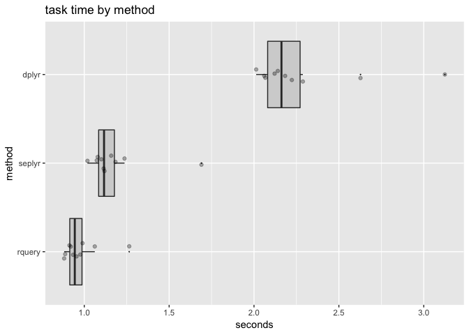

Collecting Expressions
================

An example showing the advantage of being able to collect many expressions and pack them into a single `extend_se()` node. This example may seem extreme or unnatural. However we have seen once you expose a system to enough users you see a lot more extreme use cases than you would at first expect. We have actually seen large tens of columns added to a mart in a large irregular block (so not the same transform for each columns) by building up long pipelines, so this simplified example is in fact relevant to production deployments.

First set up our packages, database connection, and remote table.

``` r
library("dplyr")
```

    ## Warning: package 'dplyr' was built under R version 3.5.1

    ## 
    ## Attaching package: 'dplyr'

    ## The following objects are masked from 'package:stats':
    ## 
    ##     filter, lag

    ## The following objects are masked from 'package:base':
    ## 
    ##     intersect, setdiff, setequal, union

``` r
library("rquery")
library("microbenchmark")
library("ggplot2")
library("WVPlots")
library("rqdatatable")
library("cdata")

# connect
con <- DBI::dbConnect(RPostgreSQL::PostgreSQL(),
                      host = 'localhost',
                      port = 5432,
                      user = 'johnmount',
                      password = '')

# configure rquery connection options
dbopts <- rq_connection_tests(con)
db_hdl <- rquery_db_info(
  connection = con,
  is_dbi = TRUE,
  connection_options = dbopts)

td <- rq_copy_to(db_hdl, 
                 "d",
                 data.frame(x = 1:5),
                 overwrite = TRUE,
                 temporary = TRUE)

tbl <- dplyr::tbl(con, "d")

ncol <- 100
```

[`rquery`](https://CRAN.R-project.org/package=rquery) torture function: add 100 columns.

``` r
rquery_fn <- function(db_hdl, td, ncol) {
  expressions <- character(0)
  for(i in seq_len(ncol)) {
    expri <- paste0("x_", i) %:=% paste0("x + ", i)
    expressions <- c(expressions, expri)
  }
  ops <- td %.>%
    extend_se(., expressions)
  db_hdl %.>% ops
}

rquery_fn(db_hdl, td, 5)
```

    ##   x x_1 x_2 x_3 x_4 x_5
    ## 1 1   2   3   4   5   6
    ## 2 2   3   4   5   6   7
    ## 3 3   4   5   6   7   8
    ## 4 4   5   6   7   8   9
    ## 5 5   6   7   8   9  10

Same torture for [`dplyr`](https://CRAN.R-project.org/package=dplyr).

``` r
dplyr_fn <- function(tbl, ncol) {
  pipeline <- tbl
  xvar <- rlang::sym("x")
  for(i in seq_len(ncol)) {
    res_i <- rlang::sym(paste0("x_", i))
    pipeline <- pipeline %>%
      mutate(., !!res_i := !!xvar + i)
  }
  pipeline %>% collect(.)
}

dplyr_fn(tbl, 5)
```

    ## # A tibble: 5 x 6
    ##       x   x_1   x_2   x_3   x_4   x_5
    ## * <int> <int> <int> <int> <int> <int>
    ## 1     1     2     3     4     5     6
    ## 2     2     3     4     5     6     7
    ## 3     3     4     5     6     7     8
    ## 4     4     5     6     7     8     9
    ## 5     5     6     7     8     9    10

Time the functions.

``` r
timings <- microbenchmark(
  rquery = rquery_fn(db_hdl, td, ncol),
  dplyr = dplyr_fn(tbl, ncol),
  times = 10L)

saveRDS(timings, "CollectExprs_timings.RDS")
```

Present the results.

``` r
print(timings)
```

    ## Unit: milliseconds
    ##    expr       min        lq     mean    median        uq       max neval
    ##  rquery  128.3562  132.5843  141.671  135.3425  155.7883  172.7109    10
    ##   dplyr 1503.8006 1549.2284 1581.519 1572.8269 1604.8545 1697.8595    10

``` r
#autoplot(timings)

timings <- as.data.frame(timings)
timings$seconds <- timings$time/10^9
timings$method <- factor(timings$expr)
timings$method <- reorder(timings$method, timings$seconds)
WVPlots::ScatterBoxPlotH(timings, "seconds", "method", "task time by method")
```



``` r
tratio <- timings %.>%
  project_nse(., 
              groupby = "method", 
              mean_seconds = mean(seconds)) %.>%
  pivot_to_rowrecs(., 
                   columnToTakeKeysFrom = "method", 
                   columnToTakeValuesFrom = "mean_seconds", 
                   rowKeyColumns = NULL) %.>%
  extend_nse(.,
             ratio = dplyr/rquery)[]

tratio
```

    ##       dplyr   rquery    ratio
    ## 1: 1.581519 0.141671 11.16332

``` r
ratio_str <- sprintf("%.2g", tratio$ratio)
```

`rquery` is about 11 times faster than `dplyr` for this task.

``` r
DBI::dbDisconnect(con)
```

    ## [1] TRUE
