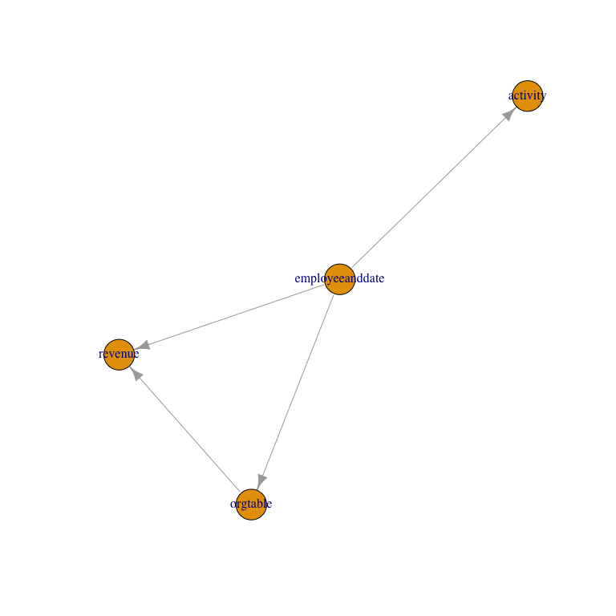
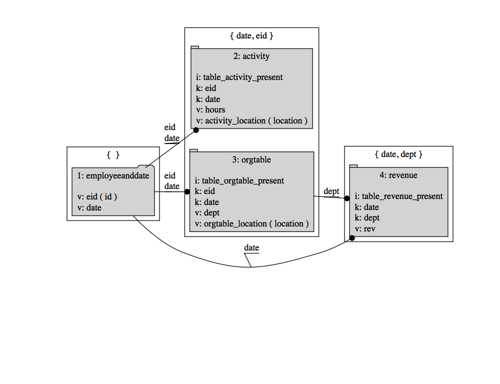

Join Dependency Sorting
================
John Mount
2018-04-18

Let's discuss the task of left joining many tables from a data warehouse using [`R`](https://www.r-project.org) and a system called "a join controller" (last discussed [here](http://www.win-vector.com/blog/2017/06/use-a-join-controller-to-document-your-work/)).

One of the great advantages to specifying complicated sequences of operations in data (rather than in code) is: it is often easier to transform and extend data. Explicit rich data beats vague convention and complicated code.

For example suppose we have a `DBI` `RSQLite` database handle in the variable `my_db` and we are using the following names for our tables in this database.

``` r
execute_vignette <- requireNamespace("RSQLite", quietly = TRUE) &&
  requireNamespace("igraph", quietly = TRUE) &&
  requireNamespace("DiagrammeR", quietly = TRUE) 
```

``` r
my_db <- DBI::dbConnect(RSQLite::SQLite(), ":memory:")
RSQLite::initExtension(my_db)
exDesc <- rquery:::example_employee_date(my_db)
tableNames <- c('employeeanddate',
                'revenue',
                'activity',
                'orgtable')
```

We can now use `rquery::describe_tables()` to get descriptions of these tables *including* any declared primary key structure.

``` r
library("rquery")
```

    ## Loading required package: wrapr

``` r
packageVersion("rquery")
```

    ## [1] '0.4.3'

``` r
tDesc <- describe_tables(my_db, tableNames,
                         keyInspector = key_inspector_sqlite)

tDesc[, qc(tableName, columns, keys, colClass)] %.>%
  knitr::kable(.)
```

| tableName       | columns                               | keys              | colClass                                            |
|:----------------|:--------------------------------------|:------------------|:----------------------------------------------------|
| employeeanddate | c("id", "date")                       | character(0)      | c("character", "integer")                           |
| revenue         | c("date", "dept", "rev")              | c("date", "dept") | c("integer", "character", "integer")                |
| activity        | c("eid", "date", "hours", "location") | c("eid", "date")  | c("character", "integer", "integer", "character")   |
| orgtable        | c("eid", "date", "dept", "location")  | c("eid", "date")  | c("character", "integer", "character", "character") |

This is more legible if we turn it into a column join plan.

``` r
columnJoinPlan <- build_join_plan(tDesc, check= FALSE)
columnJoinPlan[,  qc(tableName, sourceColumn, resultColumn, isKey)] %.>%
  knitr::kable(.)
```

|           | tableName       | sourceColumn | resultColumn       | isKey |
|-----------|:----------------|:-------------|:-------------------|:------|
| id        | employeeanddate | id           | id                 | FALSE |
| date      | employeeanddate | date         | date               | FALSE |
| date1     | revenue         | date         | date               | TRUE  |
| dept      | revenue         | dept         | dept               | TRUE  |
| rev       | revenue         | rev          | rev                | FALSE |
| eid       | activity        | eid          | eid                | TRUE  |
| date2     | activity        | date         | date               | TRUE  |
| hours     | activity        | hours        | hours              | FALSE |
| location  | activity        | location     | activity\_location | FALSE |
| eid1      | orgtable        | eid          | eid                | TRUE  |
| date3     | orgtable        | date         | date               | TRUE  |
| dept1     | orgtable        | dept         | dept               | FALSE |
| location1 | orgtable        | location     | orgtable\_location | FALSE |

At this point we are *almost* ready to execute a left join plan on these four tables. What we need to do is:

-   Regularize the key structure of the tables. In our example the analyst would have the domain knowledge that the `id` column in the `employeeanddate` table is an "employee id" and mean to match the `eid` columns in other tables.
-   Specify a left-most or controlling table for the analysis. In this case it is `employeeanddate` which we assume the analyst created through a join or cross-product of an employee list and set of dates. The left most table represents the experimental design or the exact set of row if the other tables are uniquely keyed. The left join outcome depends on rows and values in the left most table, and not on its declared key structure (that is why we do not care that the `employeeanddate` has no declared keys, which is common for derived tables).
-   Find an ordering of the rest of the tables that makes the left join executable or realizable (more on this later).

First let's patch up the key structure. This could be done by exporting the `columnJoinPlan` as a spreadsheet and editing it, but for our example we will just alter it in place.

``` r
columnJoinPlan$resultColumn[columnJoinPlan$sourceColumn=='id'] <- 'eid'
columnJoinPlan[,  qc(tableName, sourceColumn, resultColumn, isKey)] %.>%
  knitr::kable(.)
```

|           | tableName       | sourceColumn | resultColumn       | isKey |
|-----------|:----------------|:-------------|:-------------------|:------|
| id        | employeeanddate | id           | eid                | FALSE |
| date      | employeeanddate | date         | date               | FALSE |
| date1     | revenue         | date         | date               | TRUE  |
| dept      | revenue         | dept         | dept               | TRUE  |
| rev       | revenue         | rev          | rev                | FALSE |
| eid       | activity        | eid          | eid                | TRUE  |
| date2     | activity        | date         | date               | TRUE  |
| hours     | activity        | hours        | hours              | FALSE |
| location  | activity        | location     | activity\_location | FALSE |
| eid1      | orgtable        | eid          | eid                | TRUE  |
| date3     | orgtable        | date         | date               | TRUE  |
| dept1     | orgtable        | dept         | dept               | FALSE |
| location1 | orgtable        | location     | orgtable\_location | FALSE |

Now we can worry about left join order.

The most important choice in a left join plan is which table is left-most. If all the other tables are addressed by primary keys (i.e., there is not more than one row matching any row of the left-table) then the left-most table completely determines the set of rows in the left join result, no matter how many tables we are joining in. The order the rest of the tables are joined becomes irrelevant assuming it is an order we can execute.

What prevents a proposed left join order from being executable is trying to join in a table that has a key that we do not yet have values for. Let's show this as part of our example. Suppose we know that we want the table "`employeeanddate`" to be the left-most table in our left join sequence (and again, this is the one important choice). We can see our current left join plan (`columnJoinPlan`) is not executable in the order it is currently specifying:

``` r
print(paste("issues:", inspect_join_plan(tDesc, columnJoinPlan)))
```

    ## [1] "issues: key col(s) ( dept ) not contained in result cols of previous table(s) for table: revenue"

This message is saying: when it comes time to join in the "`revenue`" table rows do not yet have values for the "`dept`" key column (so we can't do the join in that order).

The table to table conditions are well-defined if a few invariants and conventions are maintained in the `tDesc` table descriptions:

-   Each `resultColumn` name can occur at most once with `isKey==FALSE`.
-   `resultColumn` names with `isKey==TRUE` have the same interpretation in all tables (due to the ability to re-map names from `sourceColumn`).
-   The left-most table is treated as special in that it is "joinable" no matter what key constraints it does or does not declare and no other table can be joined before it.

Since not all orders are valid left join plans the task is to find a re-ordering (if there is one) that is a valid left join plan. The requirement that each table's keys have known values before we join gives us order relations on the tables (we know which tables must be joined before others). Finding an ordering that obeys all the relations is called "topological sorting" We can compute the join path dependencies *and* re-order the join plan to be realizable as follows (assuming the `igraph` package is available do perform the topological sorting and plot the directed relations).

``` r
sorted <- topo_sort_tables(columnJoinPlan, 'employeeanddate')
plot(sorted$dependencyGraph)
```



``` r
print(sorted$tableOrder)
```

    ## [1] "employeeanddate" "activity"        "orgtable"        "revenue"

In the above graph a table can only be joined after all of the tables pointing to it have been joined. See that this captures that the "`revenue`" table must be joined after the "`orgtable`" (as "`orgtable`" is our mapping from employees to departments). We could work on the legibility of the above graph using `igraph` controls, but I feel that it is just as well to move on to the detailed `DiagrammeR` based left join diagrams.

And (again assuming we have the `igraph` package), we have a new `sorted$columnJoinPlan` that passes checks:

``` r
paste("issues:", inspect_join_plan(tDesc, 
                                   sorted$columnJoinPlan))
```

    ## [1] "issues: "

The new `sorted$columnJoinPlan` can be re-plotted (needs the suggested packages: `DiagrammeR`, `htmlwidgets`, `webshot`, and `magick`):

``` r
sorted$columnJoinPlan %.>%
  graph_join_plan(.) %.>%
  DiagrammeR::grViz(.)
```



And the new `sorted$columnJoinPlan` is ready to be executed:

``` r
optree <- actualize_join_plan(sorted$columnJoinPlan)

cat(format(optree))
```

    ## table('employeeanddate') %.>%
    ##  rename(.,
    ##   c('eid' = 'id',
    ##     'date' = 'date')) %.>%
    ##  natural_join(.,
    ##   table('activity') %.>%
    ##    rename(.,
    ##     c('eid' = 'eid',
    ##       'date' = 'date',
    ##       'hours' = 'hours',
    ##       'activity_location' = 'location')),
    ##   j= LEFT, by= eid, date) %.>%
    ##  natural_join(.,
    ##   table('orgtable') %.>%
    ##    rename(.,
    ##     c('eid' = 'eid',
    ##       'date' = 'date',
    ##       'dept' = 'dept',
    ##       'orgtable_location' = 'location')),
    ##   j= LEFT, by= eid, date) %.>%
    ##  natural_join(.,
    ##   table('revenue'),
    ##   j= LEFT, by= date, dept)

``` r
optree %.>%
  op_diagram(., merge_tables = TRUE) %.>%
  DiagrammeR::grViz(.)
```


``` r
execute(my_db, optree) %.>%
  knitr::kable(.)
```

|      date| dept | activity\_location | eid |  hours| orgtable\_location |   rev|
|---------:|:-----|:-------------------|:----|------:|:-------------------|-----:|
|  20140501| IT   | office             | i4  |     50| CA                 |    NA|
|  20140601| SL   | client             | i4  |      3| TX                 |  2000|

And this is how we use tools to do the heavy lifting in building a left join plan:

-   The table descriptions can be largely built by `rquery::describe_tables()`.
-   The column names can be disambiguated by `rquery::build_join_plan()`.
-   The user can then export `columnJoinPlan` and refine the definition of table keys using an editor or spreadsheet software. This is key documentation that should be shared with other groups and kept under source-control.
-   `rquery::topo_sort_tables()` can then reorder `columnJoinPlan` to bring the tables together in a realizable order.
-   `rquery::op_diagram() %.>% DiagrammeR::grViz(.)` can then produce and capture a detailed diagram of the final join plan.
-   Finally `rquery::actualize_join_plan()` realizes the join plan as an `rquery` operation tree.

``` r
DBI::dbDisconnect(my_db)
```
