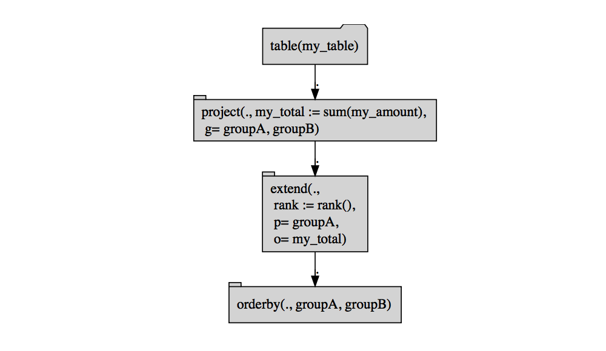

Grouped Example
================

Based on this \[<https://community.rstudio.com/t/dplyr-version-of-sql-partition-by-with-sort-order-for-use-with-sql-backend/7822/16>\](<https://community.rstudio.com/t/dplyr-version-of-sql-partition-by-with-sort-order-for-use-with-sql-backend/7822/16>.

``` r
library("dplyr")
```

    ## 
    ## Attaching package: 'dplyr'

    ## The following objects are masked from 'package:stats':
    ## 
    ##     filter, lag

    ## The following objects are masked from 'package:base':
    ## 
    ##     intersect, setdiff, setequal, union

``` r
library("rquery")
```

    ## Loading required package: wrapr

``` r
my_table <- build_frame(
   "groupA", "groupB", "my_amount" |
   "A"     , "C"     , 4           |
   "A"     , "D"     , 2           |
   "A"     , "D"     , 1           |
   "B"     , "C"     , 3           |
   "B"     , "D"     , 4           |
   "B"     , "D"     , 1           )

db <- DBI::dbConnect(RPostgreSQL::PostgreSQL(),
                     host = 'localhost',
                     port = 5432,
                     user = 'johnmount',
                     password = '')

my_table <- copy_to(db, my_table)

dpipe <- . %>%
  group_by(groupA, groupB) %>%
  summarise(my_total = sum(my_amount, na.rm = TRUE)) %>%
  arrange(my_total) %>%
  mutate(rank = row_number()) %>%
  ungroup() %>%
  arrange(groupA, groupB)

my_table %>% 
  dpipe %>% 
  dbplyr::remote_query()
```

    ## <SQL> SELECT "groupA", "groupB", "my_total", row_number() OVER (PARTITION BY "groupA" ORDER BY "my_total") AS "rank"
    ## FROM (SELECT *
    ## FROM (SELECT "groupA", "groupB", SUM("my_amount") AS "my_total"
    ## FROM "my_table"
    ## GROUP BY "groupA", "groupB") "pnxjepeohj"
    ## ORDER BY "my_total") "dcaatbuyyv"
    ## ORDER BY "groupA", "groupB"

``` r
my_table %>% 
  dpipe 
```

    ## # Source:     lazy query [?? x 4]
    ## # Database:   postgres 10.0.3 [johnmount@localhost:5432/johnmount]
    ## # Ordered by: my_total, groupA, groupB
    ##   groupA groupB my_total  rank
    ##   <chr>  <chr>     <dbl> <dbl>
    ## 1 A      C             4     2
    ## 2 A      D             3     1
    ## 3 B      C             3     1
    ## 4 B      D             5     2

``` r
table_handle <- rquery::dbi_table(db, "my_table")

optree <- table_handle %.>%
  project_nse(., 
             my_total = sum(my_amount),
             groupby = qc(groupA, groupB)) %.>%
  extend_nse(.,
             rank = rank(),
             partitionby = "groupA",
             orderby = "my_total") %.>%
  orderby(., qc(groupA, groupB))

class(optree)
```

    ## [1] "relop_orderby" "relop"

``` r
cat(format(optree))
```

    ## table('my_table') %.>%
    ##  project(., my_total := sum(my_amount),
    ##   g= groupA, groupB) %.>%
    ##  extend(.,
    ##   rank := rank(),
    ##   p= groupA,
    ##   o= my_total) %.>%
    ##  orderby(., groupA, groupB)

``` r
optree %.>% 
  op_diagram(.) %.>% 
  DiagrammeR::grViz(.)
```



``` r
cat(to_sql(optree, db))
```

    ## SELECT * FROM (
    ##  SELECT
    ##   "groupA",
    ##   "groupB",
    ##   "my_total",
    ##   rank ( ) OVER (  PARTITION BY "groupA" ORDER BY "my_total" ) AS "rank"
    ##  FROM (
    ##   SELECT "groupA", "groupB", sum ( "my_amount" ) AS "my_total" FROM (
    ##    SELECT
    ##     "my_table"."groupA",
    ##     "my_table"."groupB",
    ##     "my_table"."my_amount"
    ##    FROM
    ##     "my_table"
    ##    ) tsql_33178416985461750469_0000000000
    ##   GROUP BY
    ##    "groupA", "groupB"
    ##   ) tsql_33178416985461750469_0000000001
    ## ) tsql_33178416985461750469_0000000002 ORDER BY "groupA", "groupB"

``` r
execute(db, optree)
```

    ##   groupA groupB my_total rank
    ## 1      A      C        4    2
    ## 2      A      D        3    1
    ## 3      B      C        3    1
    ## 4      B      D        5    2

``` r
DBI::dbDisconnect(db)
```

    ## [1] TRUE
