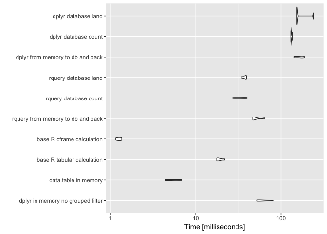
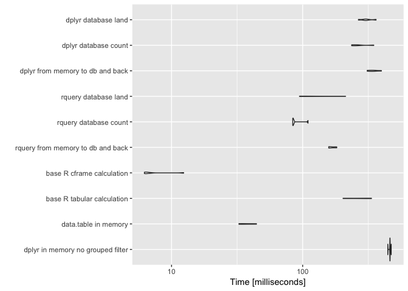
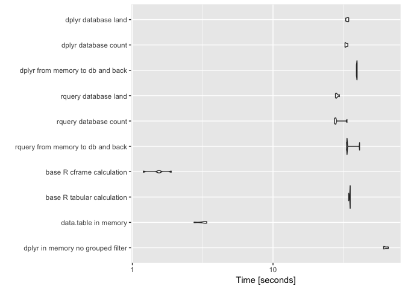

QTiming
================
Win-Vector LLC
1/10/2018

Let's time [`rquery`](https://winvector.github.io/rquery/), [`dplyr`](https://CRAN.R-project.org/package=dplyr), and [`data.table`](https://CRAN.R-project.org/package=data.table) on a non-trivial example.

These timings are on an late 2014 Mac Mini with 8GB of RAM running OSX 10.12.6, version 3.4.3 (2017-11-30) -- "Kite-Eating Tree", and the current (2018-01-07) CRAN versions of all packages (except `rquery`, which is not yet up on CRAN). We are getting database services from PostgreSQL version `9.6.1` in a docker container.

First let's load our packages, establish a database connection, and declare an [`rquery` ad hoc execution service](https://winvector.github.io/rquery/articles/AdHocQueries.html) (the "`winvector_temp_db_handle`").

``` r
library("rquery")
```

    ## Loading required package: wrapr

    ## Loading required package: cdata

``` r
library("dplyr")
```

    ## 
    ## Attaching package: 'dplyr'

    ## The following objects are masked from 'package:stats':
    ## 
    ##     filter, lag

    ## The following objects are masked from 'package:base':
    ## 
    ##     intersect, setdiff, setequal, union

``` r
library("microbenchmark")
library("ggplot2")
source("cscan.R")
source("fns.R")

db <- NULL
# db <- DBI::dbConnect(RPostgres::Postgres(),
#                      host = 'localhost',
#                      port = 5432,
#                      user = 'postgres',
#                      password = 'pg')
if(!is.null(db)) {
  winvector_temp_db_handle <- list(db = db)
  print(db)
  DBI::dbGetQuery(db, "SELECT version()", stringsAsFactors = FALSE)
}

packageVersion("rquery")
```

    ## [1] '0.2.0'

``` r
packageVersion("dplyr")
```

    ## [1] '0.7.4'

``` r
packageVersion("dbplyr")
```

    ## [1] '1.2.0'

``` r
packageVersion("DBI")
```

    ## [1] '0.7'

``` r
packageVersion("data.table")
```

    ## [1] '1.10.4.3'

``` r
packageVersion("RPostgres")
```

    ## [1] '1.0.4'

``` r
R.Version()
```

    ## $platform
    ## [1] "x86_64-apple-darwin15.6.0"
    ## 
    ## $arch
    ## [1] "x86_64"
    ## 
    ## $os
    ## [1] "darwin15.6.0"
    ## 
    ## $system
    ## [1] "x86_64, darwin15.6.0"
    ## 
    ## $status
    ## [1] ""
    ## 
    ## $major
    ## [1] "3"
    ## 
    ## $minor
    ## [1] "4.3"
    ## 
    ## $year
    ## [1] "2017"
    ## 
    ## $month
    ## [1] "11"
    ## 
    ## $day
    ## [1] "30"
    ## 
    ## $`svn rev`
    ## [1] "73796"
    ## 
    ## $language
    ## [1] "R"
    ## 
    ## $version.string
    ## [1] "R version 3.4.3 (2017-11-30)"
    ## 
    ## $nickname
    ## [1] "Kite-Eating Tree"

We now build and extended version of the example from [Let’s Have Some Sympathy For The Part-time R User](http://www.win-vector.com/blog/2017/08/lets-have-some-sympathy-for-the-part-time-r-user/).

``` r
nrep <- 10

dLocal <- mkData(nrep)
head(dLocal)
```

    ##   subjectID      surveyCategory assessmentTotal
    ## 1        s1 withdrawal behavior               2
    ## 2        s1 positive re-framing               6
    ## 3       s10 withdrawal behavior               1
    ## 4       s10 positive re-framing               6
    ## 5        s2 withdrawal behavior               5
    ## 6        s2 positive re-framing               1

``` r
dR <- NULL
dTbl <- NULL

if(!is.null(db)) {
  dR <- rquery::dbi_copy_to(db, 'dR',
                            dLocal,
                            temporary = TRUE, 
                            overwrite = TRUE)
  dTbl <- dplyr::tbl(db, dR$table_name)
  
  cdata::qlook(db, dR$table_name)
  
  dplyr::glimpse(dTbl)
}
```

Now we declare our operation pipelines, both on local (in-memory `data.frame`) and remote (already in a database) data.

``` r
scale <- 0.237

base_R_row_calculation <- function() {
  base_r_calculate_rows(dLocal)
}

base_R_sequential_calculation <- function() {
  base_r_calculate_sequenced(dLocal)
}

base_R_cframe_calculation <- function() {
  base_r_calculate_cframe(dLocal)
}


base_R_tabular_calculation <- function() {
  base_r_calculate_tabular(dLocal)
}

rquery_local <- function() {
  dLocal %.>% 
    rquery_pipeline(.) %.>%
    as.data.frame(., stringsAsFactors = FALSE) # force execution
}

rquery_database_pull <- function() {
  dR %.>% 
    rquery_pipeline(.) %.>% 
    to_sql(., db) %.>% 
    DBI::dbGetQuery(db, ., stringsAsFactors = FALSE) %.>%
    as.data.frame(., stringsAsFactors = FALSE) # shouldn't be needed
}

rquery_database_land <- function() {
  tabName <- "rquery_tmpx"
  sqlc <- dR %.>% 
    rquery_pipeline(.) %.>% 
    to_sql(., db)
  DBI::dbExecute(db, paste("CREATE TABLE", tabName, "AS", sqlc))
  DBI::dbExecute(db, paste("DROP TABLE", tabName))
  NULL
}

rquery_database_count <- function() {
  dR %.>% 
    rquery_pipeline(.) %.>% 
    sql_node(., "n" := "COUNT(1)") %.>% 
    to_sql(., db) %.>% 
    DBI::dbGetQuery(db, ., stringsAsFactors = FALSE) %.>%
    as.data.frame(., stringsAsFactors = FALSE) # shouldn't be needed
}


dplyr_local <- function() {
  dLocal %>% 
    dplyr_pipeline
}

dplyr_local_no_grouped_filter <- function() {
  dLocal %>% 
    dplyr_pipeline2
}

dplyr_tbl <- function() {
  dLocal %>%
    as_tibble %>%
    dplyr_pipeline
}

dplyr_round_trip <- function() {
  dTmp <- dplyr::copy_to(db, dLocal, "dplyr_tmp",
                         # overwrite = TRUE,
                         temporary = TRUE
  )
  res <- dTmp %>% 
    dplyr_pipeline %>%
    collect()
  dplyr::db_drop_table(db, "dplyr_tmp")
  res
}

dplyr_database_pull <- function() {
  dTbl %>% 
    dplyr_pipeline %>%
    collect()
}

dplyr_database_land <- function() {
  tabName = "dplyr_ctmpx"
  dTbl %>% 
    dplyr_pipeline %>%
    compute(name = tabName)
  dplyr::db_drop_table(db, table = tabName)
  NULL
}

dplyr_database_count <- function() {
  dTbl %>% 
    dplyr_pipeline %>%
    tally() %>%
    collect()
}
```

Let's inspect the functions.

``` r
check <- base_R_sequential_calculation()
head(check)
```

    ##   subjectID           diagnosis probability
    ## 1        s1 positive re-framing   0.7207128
    ## 2       s10 positive re-framing   0.7658456
    ## 3        s2 withdrawal behavior   0.7207128
    ## 4        s3 withdrawal behavior   0.5589742
    ## 5        s4 withdrawal behavior   0.6706221
    ## 6        s5 withdrawal behavior   0.5589742

``` r
if(!equiv_res(check, base_R_cframe_calculation())) {
  stop("mismatch")
}

if(!equiv_res(check, base_R_row_calculation())) {
  stop("mismatch")
}

if(!equiv_res(check, base_R_tabular_calculation())) {
  stop("mismatch")
}

if(!equiv_res(check, dplyr_local())) {
  stop("mismatch")
}

if(!equiv_res(check, dplyr_tbl())) {
  stop("mismatch")
}

if(!equiv_res(check, dplyr_local_no_grouped_filter())) {
  stop("mismatch")
}

if(!equiv_res(check, data.table_local())) {
  stop("mismatch")
}

if(!is.null(db)) {
  head(rquery_local())
  
  rquery_database_land()
  
  head(rquery_database_pull())
  
  rquery_database_count()
  
  dplyr_database_land()
  
  head(dplyr_database_pull())
  
  dplyr_database_count()
  
  head(dplyr_round_trip())
}
```

Now let's measure the speeds with `microbenchmark`.

``` r
timings <- NULL

expressions <- list(
    # "rquery in memory" = bquote({ nrow(rquery_local())}),
    # "rquery from db to memory" =  bquote({nrow(rquery_database_pull())}),
    # "rquery database count" =  bquote({rquery_database_count()}),
    # "rquery database land" =  bquote({rquery_database_land()}),
    # "dplyr in memory" =  bquote({nrow(dplyr_local())}),
    # "dplyr tbl in memory" =  bquote({nrow(dplyr_tbl())}),
    "dplyr in memory no grouped filter" =  bquote({nrow(dplyr_local_no_grouped_filter())}),
    # "dplyr from memory to db and back" =  bquote({nrow(dplyr_round_trip())}),
    # "dplyr from db to memory" =  bquote({nrow(dplyr_database_pull())}),
    # "dplyr database count" =  bquote({dplyr_database_count()}),
    # "dplyr database land" =  bquote({dplyr_database_land()}),
    "data.table in memory" =  bquote({nrow(data.table_local())}),
    # "base R row calculation" =  bquote({nrow(base_R_row_calculation())}),
    "base R tabular calculation" =  bquote({nrow(base_R_tabular_calculation())}),
    "base R sequential calculation" =  bquote({nrow(base_R_sequential_calculation())}),
    "base R cframe calculation" =  bquote({nrow(base_R_cframe_calculation())})
)

prune <- FALSE

for(nrep in c(1, 10, 100, 1000, 10000, 100000, 1000000)) {
  print(nrep)
  dLocal <- mkData(nrep)
  dR <- NULL
  dTbl <- NULL
  if(!is.null(db)) {
    dR <- rquery::dbi_copy_to(db, 'dR',
                              dLocal,
                              temporary = TRUE, 
                              overwrite = TRUE)
    dTbl <- dplyr::tbl(db, dR$table_name)
  }
  tm <- microbenchmark(
    list = expressions,
    times = 5L
  )
  print(tm)
  print(autoplot(tm))
  tmi <- as.data.frame(tm, stringsAsFactors = FALSE)
  tmi$data_size <- nrow(dLocal)
  timings <- rbind(timings, tmi)
  if(prune) {
    baddies <- unique(tmi$expr[tmi$time > 10*1e+9])
    for(bi in baddies) {
      expressions[[bi]] <- NULL
    }
    if(length(expressions)<=0) {
      break
    }
  }
}
```

    ## [1] 1
    ## Unit: microseconds
    ##                               expr       min        lq      mean    median
    ##  dplyr in memory no grouped filter 18029.631 18090.968 19874.981 18463.753
    ##               data.table in memory  2950.063  3103.032  3889.781  3307.760
    ##         base R tabular calculation  2435.566  2504.637  2709.560  2574.058
    ##      base R sequential calculation   977.839  1084.292  1350.896  1124.360
    ##          base R cframe calculation   715.917   728.655  1113.571   852.240
    ##         uq       max neval
    ##  21837.053 22953.502     5
    ##   4061.275  6026.776     5
    ##   2616.704  3416.836     5
    ##   1312.295  2255.693     5
    ##   1364.072  1906.972     5


    ## [1] 10
    ## Unit: microseconds
    ##                               expr       min        lq       mean
    ##  dplyr in memory no grouped filter 17355.091 18630.765 19207.5024
    ##               data.table in memory  2943.796  3322.241  3333.8378
    ##         base R tabular calculation  2569.796  2668.071  2700.2576
    ##      base R sequential calculation   927.529   946.671   997.9274
    ##          base R cframe calculation   733.461   735.768   791.9200
    ##     median        uq       max neval
    ##  18830.311 20029.578 21191.767     5
    ##   3429.761  3467.780  3505.611     5
    ##   2689.146  2726.026  2848.249     5
    ##    969.794  1064.785  1080.858     5
    ##    757.234   863.170   869.967     5


    ## [1] 100
    ## Unit: microseconds
    ##                               expr       min        lq       mean
    ##  dplyr in memory no grouped filter 20776.812 20790.092 21135.6410
    ##               data.table in memory  3888.047  4001.204  4736.0464
    ##         base R tabular calculation  3838.324  4195.901  4267.3548
    ##      base R sequential calculation  1129.205  1134.532  1226.1660
    ##          base R cframe calculation   777.307   810.077   831.7708
    ##     median        uq       max neval
    ##  20813.288 20934.969 22363.044     5
    ##   4378.748  4859.964  6552.269     5
    ##   4337.077  4340.997  4624.475     5
    ##   1257.995  1301.191  1307.907     5
    ##    819.349   842.008   910.113     5


    ## [1] 1000
    ## Unit: milliseconds
    ##                               expr       min        lq      mean    median
    ##  dplyr in memory no grouped filter 53.277379 56.283258 56.518534 56.986974
    ##               data.table in memory 13.895675 15.157758 16.099401 15.159958
    ##         base R tabular calculation 17.630975 19.665729 20.274555 21.255697
    ##      base R sequential calculation  3.507768  3.747842  4.064723  3.756977
    ##          base R cframe calculation  1.297327  1.384422  1.405739  1.385828
    ##         uq       max neval
    ##  57.194273 58.850788     5
    ##  16.662014 19.621598     5
    ##  21.300897 21.519477     5
    ##   4.240363  5.070664     5
    ##   1.427788  1.533329     5



    ## [1] 10000
    ## Unit: milliseconds
    ##                               expr        min         lq      mean
    ##  dplyr in memory no grouped filter 407.194608 409.381147 412.74636
    ##               data.table in memory 117.525634 118.002116 122.24871
    ##         base R tabular calculation 203.172277 204.752756 231.25617
    ##      base R sequential calculation  28.440738  28.773298  30.25059
    ##          base R cframe calculation   5.421187   8.243956  22.46094
    ##      median        uq       max neval
    ##  412.053400 413.20493 421.89774     5
    ##  118.017227 126.21587 131.48272     5
    ##  209.426222 269.21866 269.71093     5
    ##   29.872876  30.70347  33.46255     5
    ##    9.429168  11.45645  77.75396     5



    ## [1] 1e+05
    ## Unit: milliseconds
    ##                               expr       min        lq      mean    median
    ##  dplyr in memory no grouped filter 5009.6724 5071.2713 5336.1437 5360.2855
    ##               data.table in memory 1209.0905 1216.4174 1359.4933 1290.7941
    ##         base R tabular calculation 3286.6013 3350.1026 3469.2846 3413.1398
    ##      base R sequential calculation  435.7051  436.9898  501.5108  472.5926
    ##          base R cframe calculation  118.9245  144.8517  167.6424  167.3377
    ##         uq       max neval
    ##  5386.3364 5853.1527     5
    ##  1309.0351 1772.1296     5
    ##  3632.4043 3664.1749     5
    ##   500.0462  662.2201     5
    ##   202.6292  204.4689     5


    ## [1] 1e+06
    ## Unit: seconds
    ##                               expr       min        lq      mean    median
    ##  dplyr in memory no grouped filter 60.196606 63.884183 64.697394 65.729426
    ##               data.table in memory 12.482061 12.927247 13.910871 12.944006
    ##         base R tabular calculation 36.533878 37.097115 39.022185 37.229347
    ##      base R sequential calculation  5.215866  5.409082  5.579928  5.647000
    ##          base R cframe calculation  1.573378  1.663325  1.864483  1.904648
    ##         uq       max neval
    ##  66.460299 67.216457     5
    ##  13.288324 17.912717     5
    ##  38.935957 45.314626     5
    ##   5.781366  5.846327     5
    ##   1.963380  2.217684     5



``` r
saveRDS(timings, "qtimings.RDS")
```

`rquery` appears to be relatively fast. Some of the time for "`rquery` local" is because `rquery` doesn't *really* have a local mode, it has to copy the data to the database and back in that case.

``` r
sessionInfo()
```

    ## R version 3.4.3 (2017-11-30)
    ## Platform: x86_64-apple-darwin15.6.0 (64-bit)
    ## Running under: macOS Sierra 10.12.6
    ## 
    ## Matrix products: default
    ## BLAS: /Library/Frameworks/R.framework/Versions/3.4/Resources/lib/libRblas.0.dylib
    ## LAPACK: /Library/Frameworks/R.framework/Versions/3.4/Resources/lib/libRlapack.dylib
    ## 
    ## locale:
    ## [1] en_US.UTF-8/en_US.UTF-8/en_US.UTF-8/C/en_US.UTF-8/en_US.UTF-8
    ## 
    ## attached base packages:
    ## [1] stats     graphics  grDevices utils     datasets  methods   base     
    ## 
    ## other attached packages:
    ## [1] bindrcpp_0.2         ggplot2_2.2.1        microbenchmark_1.4-3
    ## [4] dplyr_0.7.4          rquery_0.2.0         cdata_0.5.1         
    ## [7] wrapr_1.1.1         
    ## 
    ## loaded via a namespace (and not attached):
    ##  [1] Rcpp_0.12.14.2      knitr_1.18          bindr_0.1          
    ##  [4] magrittr_1.5        munsell_0.4.3       colorspace_1.3-2   
    ##  [7] R6_2.2.2            rlang_0.1.6         plyr_1.8.4         
    ## [10] stringr_1.2.0       tools_3.4.3         grid_3.4.3         
    ## [13] data.table_1.10.4-3 gtable_0.2.0        htmltools_0.3.6    
    ## [16] lazyeval_0.2.1      yaml_2.1.16         rprojroot_1.3-2    
    ## [19] digest_0.6.13       assertthat_0.2.0    tibble_1.4.1       
    ## [22] glue_1.2.0          evaluate_0.10.1     rmarkdown_1.8      
    ## [25] stringi_1.1.6       compiler_3.4.3      pillar_1.0.1       
    ## [28] scales_0.5.0        backports_1.1.2     pkgconfig_2.0.1

``` r
winvector_temp_db_handle <- NULL
if(!is.null(db)) {
  DBI::dbDisconnect(db)
  db <- NULL
}
```
