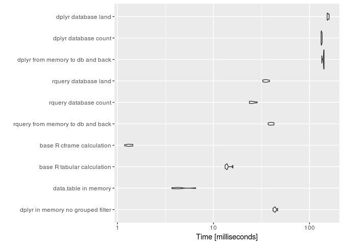
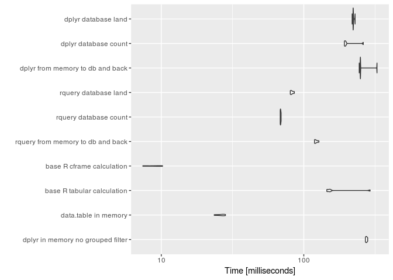

QTiming3
================
Win-Vector LLC
1/11/2018

Let's time [`rquery`](https://winvector.github.io/rquery/), [`dplyr`](https://CRAN.R-project.org/package=dplyr), and [`data.table`](https://CRAN.R-project.org/package=data.table) on a non-trivial example.

These timings are on an Amazon EC2 c5.3.xlarge 16 vCPUs 32GB RAM Ubuntu Server 16.04 LTS (HVM).

First let's load our packages, establish a database connection, and declare an [`rquery` ad hoc execution service](https://winvector.github.io/rquery/articles/AdHocQueries.html) (the "`winvector_temp_db_handle`").

``` r
library("rquery")
```

    ## Loading required package: wrapr

    ## Loading required package: cdata

``` r
library("dplyr")
```

    ## 
    ## Attaching package: 'dplyr'

    ## The following objects are masked from 'package:stats':
    ## 
    ##     filter, lag

    ## The following objects are masked from 'package:base':
    ## 
    ##     intersect, setdiff, setequal, union

``` r
library("microbenchmark")
library("ggplot2")
source("fns.R")

db <- NULL
# db <- DBI::dbConnect(RPostgres::Postgres(),
#                      host = 'wvdbtest.cv9xgzsc2qa1.us-west-2.rds.amazonaws.com',
#                      port = 5432,
#                      user = 'wvdbinstance',
#                      password = 'wvdb9327262643664',
#                      dbname = 'wvdb')
if(!is.null(db)) {
  winvector_temp_db_handle <- list(db = db)
  print(db)
  DBI::dbGetQuery(db, "SELECT version()", stringsAsFactors = FALSE)
}

packageVersion("rquery")
```

    ## [1] '0.2.0'

``` r
packageVersion("dplyr")
```

    ## [1] '0.7.4'

``` r
packageVersion("dbplyr")
```

    ## [1] '1.2.0'

``` r
packageVersion("DBI")
```

    ## [1] '0.7'

``` r
packageVersion("data.table")
```

    ## [1] '1.10.4.3'

``` r
packageVersion("RPostgres")
```

    ## [1] '1.0.4'

``` r
R.Version()
```

    ## $platform
    ## [1] "x86_64-pc-linux-gnu"
    ## 
    ## $arch
    ## [1] "x86_64"
    ## 
    ## $os
    ## [1] "linux-gnu"
    ## 
    ## $system
    ## [1] "x86_64, linux-gnu"
    ## 
    ## $status
    ## [1] ""
    ## 
    ## $major
    ## [1] "3"
    ## 
    ## $minor
    ## [1] "2.3"
    ## 
    ## $year
    ## [1] "2015"
    ## 
    ## $month
    ## [1] "12"
    ## 
    ## $day
    ## [1] "10"
    ## 
    ## $`svn rev`
    ## [1] "69752"
    ## 
    ## $language
    ## [1] "R"
    ## 
    ## $version.string
    ## [1] "R version 3.2.3 (2015-12-10)"
    ## 
    ## $nickname
    ## [1] "Wooden Christmas-Tree"

We now build and extended version of the example from [Let’s Have Some Sympathy For The Part-time R User](http://www.win-vector.com/blog/2017/08/lets-have-some-sympathy-for-the-part-time-r-user/).

``` r
nrep <- 10

dLocal <- mkData(nrep)
head(dLocal)
```

    ##   subjectID      surveyCategory assessmentTotal
    ## 1       0_1 withdrawal behavior               5
    ## 2       0_1 positive re-framing               2
    ## 3       0_2 withdrawal behavior               3
    ## 4       0_2 positive re-framing               4
    ## 5       1_1 withdrawal behavior               5
    ## 6       1_1 positive re-framing               2

``` r
dR <- NULL
dTbl <- NULL

if(!is.null(db)) {
  dR <- rquery::dbi_copy_to(db, 'dR',
                            dLocal,
                            temporary = TRUE, 
                            overwrite = TRUE)
  dTbl <- dplyr::tbl(db, dR$table_name)
  cdata::qlook(db, dR$table_name)

  dplyr::glimpse(dTbl)
}
```

Now we declare our operation pipelines, both on local (in-memory `data.frame`) and remote (already in a database) data.

``` r
scale <- 0.237

base_R_row_calculation <- function() {
  base_r_calculate_rows(dLocal)
}

base_R_sequential_calculation <- function() {
  base_r_calculate_sequenced(dLocal)
}

base_R_tabular_calculation <- function() {
  base_r_calculate_tabular(dLocal)
}

rquery_local <- function() {
  dLocal %.>% 
    rquery_pipeline(.) %.>%
    as.data.frame(., stringsAsFactors = FALSE) # force execution
}

rquery_database_pull <- function() {
  dR %.>% 
    rquery_pipeline(.) %.>% 
    to_sql(., db) %.>% 
    DBI::dbGetQuery(db, ., stringsAsFactors = FALSE) %.>%
    as.data.frame(., stringsAsFactors = FALSE) # shouldn't be needed
}

rquery_database_land <- function() {
  tabName <- "rquery_tmpx"
  sqlc <- dR %.>% 
    rquery_pipeline(.) %.>% 
    to_sql(., db)
  DBI::dbExecute(db, paste("CREATE TABLE", tabName, "AS", sqlc))
  DBI::dbExecute(db, paste("DROP TABLE", tabName))
  NULL
}

rquery_database_count <- function() {
  dR %.>% 
    rquery_pipeline(.) %.>% 
    sql_node(., "n" := "COUNT(1)") %.>% 
    to_sql(., db) %.>% 
    DBI::dbGetQuery(db, ., stringsAsFactors = FALSE) %.>%
    as.data.frame(., stringsAsFactors = FALSE) # shouldn't be needed
}


dplyr_local <- function() {
  dLocal %>% 
    dplyr_pipeline
}

dplyr_local_no_grouped_filter <- function() {
  dLocal %>% 
    dplyr_pipeline2
}

dplyr_tbl <- function() {
  dLocal %>%
    as_tibble %>%
    dplyr_pipeline
}

dplyr_round_trip <- function() {
  dTmp <- dplyr::copy_to(db, dLocal, "dplyr_tmp",
                         # overwrite = TRUE,
                         temporary = TRUE
  )
  res <- dTmp %>% 
    dplyr_pipeline %>%
    collect()
  dplyr::db_drop_table(db, "dplyr_tmp")
  res
}

dplyr_database_pull <- function() {
  dTbl %>% 
    dplyr_pipeline %>%
    collect()
}

dplyr_database_land <- function() {
  tabName = "dplyr_ctmpx"
  dTbl %>% 
    dplyr_pipeline %>%
    compute(name = tabName)
  dplyr::db_drop_table(db, table = tabName)
  NULL
}

dplyr_database_count <- function() {
  dTbl %>% 
    dplyr_pipeline %>%
    tally() %>%
    collect()
}
```

Let's inspect the functions.

``` r
head(base_R_sequential_calculation())
```

    ##   subjectID           diagnosis probability
    ## 1       0_1 withdrawal behavior   0.6706221
    ## 2       0_2 positive re-framing   0.5589742
    ## 3       1_1 withdrawal behavior   0.6706221
    ## 4       1_2 positive re-framing   0.5589742
    ## 5       2_1 withdrawal behavior   0.6706221
    ## 6       2_2 positive re-framing   0.5589742

``` r
head(base_R_row_calculation())
```

    ##    subjectID           diagnosis probability
    ## 1        0_1 withdrawal behavior   0.6706221
    ## 4        0_2 positive re-framing   0.5589742
    ## 5        1_1 withdrawal behavior   0.6706221
    ## 8        1_2 positive re-framing   0.5589742
    ## 9        2_1 withdrawal behavior   0.6706221
    ## 12       2_2 positive re-framing   0.5589742

``` r
head(base_R_tabular_calculation())
```

    ##    subjectID           diagnosis probability
    ## 1        0_1 withdrawal behavior   0.6706221
    ## 4        0_2 positive re-framing   0.5589742
    ## 5        1_1 withdrawal behavior   0.6706221
    ## 8        1_2 positive re-framing   0.5589742
    ## 9        2_1 withdrawal behavior   0.6706221
    ## 12       2_2 positive re-framing   0.5589742

``` r
head(dplyr_local())
```

    ## # A tibble: 6 x 3
    ##   subjectID diagnosis           probability
    ##   <chr>     <chr>                     <dbl>
    ## 1 0_1       withdrawal behavior       0.671
    ## 2 0_2       positive re-framing       0.559
    ## 3 1_1       withdrawal behavior       0.671
    ## 4 1_2       positive re-framing       0.559
    ## 5 2_1       withdrawal behavior       0.671
    ## 6 2_2       positive re-framing       0.559

``` r
head(dplyr_tbl())
```

    ## # A tibble: 6 x 3
    ##   subjectID diagnosis           probability
    ##   <chr>     <chr>                     <dbl>
    ## 1 0_1       withdrawal behavior       0.671
    ## 2 0_2       positive re-framing       0.559
    ## 3 1_1       withdrawal behavior       0.671
    ## 4 1_2       positive re-framing       0.559
    ## 5 2_1       withdrawal behavior       0.671
    ## 6 2_2       positive re-framing       0.559

``` r
head(dplyr_local_no_grouped_filter())
```

    ## # A tibble: 6 x 3
    ##   subjectID diagnosis           probability
    ##   <chr>     <chr>                     <dbl>
    ## 1 0_1       withdrawal behavior       0.671
    ## 2 0_2       positive re-framing       0.559
    ## 3 1_1       withdrawal behavior       0.671
    ## 4 1_2       positive re-framing       0.559
    ## 5 2_1       withdrawal behavior       0.671
    ## 6 2_2       positive re-framing       0.559

``` r
head(data.table_local())
```

    ##    subjectID           diagnosis probability
    ## 1:       0_1 withdrawal behavior   0.6706221
    ## 2:       0_2 positive re-framing   0.5589742
    ## 3:       1_1 withdrawal behavior   0.6706221
    ## 4:       1_2 positive re-framing   0.5589742
    ## 5:       2_1 withdrawal behavior   0.6706221
    ## 6:       2_2 positive re-framing   0.5589742

``` r
if(!is.null(db)) {
  head(rquery_local())
  
  rquery_database_land()
  
  head(rquery_database_pull())
  
  rquery_database_count()
  
  dplyr_database_land()
  
  head(dplyr_database_pull())
  
  dplyr_database_count()
  
  head(dplyr_round_trip())
}
```

Now let's measure the speeds with `microbenchmark`.

``` r
timings <- NULL

expressions <- list(
    # "rquery in memory" = bquote({ nrow(rquery_local())}),
    # "rquery from db to memory" =  bquote({nrow(rquery_database_pull())}),
    # "rquery database count" =  bquote({rquery_database_count()}),
    # "rquery database land" =  bquote({rquery_database_land()}),
    # "dplyr in memory" =  bquote({nrow(dplyr_local())}),
    # "dplyr tbl in memory" =  bquote({nrow(dplyr_tbl())}),
    "dplyr in memory no grouped filter" =  bquote({nrow(dplyr_local_no_grouped_filter())}),
    # "dplyr from memory to db and back" =  bquote({nrow(dplyr_round_trip())}),
    # "dplyr from db to memory" =  bquote({nrow(dplyr_database_pull())}),
    # "dplyr database count" =  bquote({dplyr_database_count()}),
    # "dplyr database land" =  bquote({dplyr_database_land()}),
    "data.table in memory" =  bquote({nrow(data.table_local())}),
    # "base R row calculation" =  bquote({nrow(base_R_row_calculation())}),
    "base R tabular calculation" =  bquote({nrow(base_R_tabular_calculation())}),
    "base R sequential calculation" =  bquote({nrow(base_R_sequential_calculation())})
)

prune <- FALSE

for(nrep in c(1, 10, 100, 1000, 10000, 100000, 1000000)) {
  print(nrep)
  dLocal <- mkData(nrep)
  dR <- NULL
  dTbl <- NULL
  if(!is.null(db)) {
    dR <- rquery::dbi_copy_to(db, 'dR',
                              dLocal,
                              temporary = TRUE, 
                              overwrite = TRUE)
    dTbl <- dplyr::tbl(db, dR$table_name)
  }
  tm <- microbenchmark(
    list = expressions,
    times = 5L
  )
  print(tm)
  print(autoplot(tm))
  tmi <- as.data.frame(tm, stringsAsFactors = FALSE)
  tmi$data_size <- nrow(dLocal)
  timings <- rbind(timings, tmi)
  if(prune) {
    baddies <- unique(tmi$expr[tmi$time > 10*1e+9])
    for(bi in baddies) {
      expressions[[bi]] <- NULL
    }
    if(length(expressions)<=0) {
      break
    }
  }
}
```

    ## [1] 1
    ## Unit: microseconds
    ##                               expr       min        lq      mean    median
    ##  dplyr in memory no grouped filter 16831.499 17034.653 18604.268 18480.475
    ##               data.table in memory  2354.292  2418.832  2455.767  2434.510
    ##         base R tabular calculation  2031.099  2074.247  2149.222  2102.732
    ##      base R sequential calculation   668.509   696.400   726.648   702.940
    ##         uq       max neval
    ##  19780.155 20894.560     5
    ##   2469.711  2601.490     5
    ##   2171.718  2366.314     5
    ##    778.250   787.141     5


    ## [1] 10
    ## Unit: microseconds
    ##                               expr       min        lq       mean
    ##  dplyr in memory no grouped filter 16843.494 17582.168 18196.3288
    ##               data.table in memory  2871.836  2877.237  2933.1832
    ##         base R tabular calculation  2412.991  2456.648  2506.7896
    ##      base R sequential calculation   682.934   683.963   796.4978
    ##     median        uq       max neval
    ##  18519.980 18769.558 19266.444     5
    ##   2916.144  2961.990  3038.709     5
    ##   2505.229  2551.298  2607.782     5
    ##    809.923   838.743   966.926     5


    ## [1] 100
    ## Unit: microseconds
    ##                               expr       min        lq      mean    median
    ##  dplyr in memory no grouped filter 19380.693 20512.041 21105.134 21159.333
    ##               data.table in memory  5806.886  6093.935  6401.374  6128.144
    ##         base R tabular calculation  4045.866  4107.867  4188.310  4126.922
    ##      base R sequential calculation   851.633   919.250   937.420   927.594
    ##         uq       max neval
    ##  21842.159 22631.442     5
    ##   6166.535  7811.370     5
    ##   4257.193  4403.703     5
    ##    989.271   999.352     5


    ## [1] 1000
    ## Unit: milliseconds
    ##                               expr       min        lq      mean   median
    ##  dplyr in memory no grouped filter 61.489571 63.409114 64.344759 64.92019
    ##               data.table in memory 39.467264 40.157137 40.728819 41.06449
    ##         base R tabular calculation 24.263190 24.481241 36.523467 24.73304
    ##      base R sequential calculation  3.160413  3.215374  3.255181  3.26873
    ##         uq      max neval
    ##  65.866376 66.03855     5
    ##  41.453611 41.50160     5
    ##  28.581553 80.55831     5
    ##   3.308596  3.32279     5



    ## [1] 10000
    ## Unit: milliseconds
    ##                               expr       min       lq      mean    median
    ##  dplyr in memory no grouped filter 501.93464 503.6320 510.58172 509.74113
    ##               data.table in memory 428.62407 430.5561 434.97721 436.69585
    ##         base R tabular calculation 361.06825 362.7805 375.51218 365.43454
    ##      base R sequential calculation  41.48234  41.6748  54.52082  42.15061
    ##         uq      max neval
    ##  511.39685 526.2040     5
    ##  437.99717 441.0129     5
    ##  368.49315 419.7845     5
    ##   45.48978 101.8066     5



    ## [1] 1e+05
    ## Unit: milliseconds
    ##                               expr       min        lq      mean    median
    ##  dplyr in memory no grouped filter 6020.9210 6037.1981 6118.2381 6159.4207
    ##               data.table in memory 4022.7808 4228.3156 4271.7601 4241.1848
    ##         base R tabular calculation 4246.6268 4292.7775 4485.6949 4543.2684
    ##      base R sequential calculation  559.0092  586.5536  641.3587  670.4461
    ##         uq       max neval
    ##  6183.8740 6189.7768     5
    ##  4279.1843 4587.3349     5
    ##  4636.7715 4709.0303     5
    ##   670.6484  720.1363     5


    ## [1] 1e+06
    ## Unit: seconds
    ##                               expr       min        lq      mean    median
    ##  dplyr in memory no grouped filter 77.035038 80.874574 82.037929 82.684246
    ##               data.table in memory 45.279641 46.613035 47.055832 46.841140
    ##         base R tabular calculation 54.779778 54.868530 55.209783 55.149351
    ##      base R sequential calculation  8.570536  8.720425  8.911384  8.833228
    ##         uq       max neval
    ##  83.520844 86.074942     5
    ##  47.716328 48.829016     5
    ##  55.242285 56.008972     5
    ##   9.084131  9.348601     5


``` r
saveRDS(timings, "qtimings3.RDS")
```

`rquery` appears to be relatively fast. Some of the time for "`rquery` local" is because `rquery` doesn't *really* have a local mode, it has to copy the data to the database and back in that case.

``` r
sessionInfo()
```

    ## R version 3.2.3 (2015-12-10)
    ## Platform: x86_64-pc-linux-gnu (64-bit)
    ## Running under: Ubuntu 16.04.3 LTS
    ## 
    ## locale:
    ##  [1] LC_CTYPE=en_US.UTF-8       LC_NUMERIC=C              
    ##  [3] LC_TIME=en_US.UTF-8        LC_COLLATE=en_US.UTF-8    
    ##  [5] LC_MONETARY=en_US.UTF-8    LC_MESSAGES=en_US.UTF-8   
    ##  [7] LC_PAPER=en_US.UTF-8       LC_NAME=C                 
    ##  [9] LC_ADDRESS=C               LC_TELEPHONE=C            
    ## [11] LC_MEASUREMENT=en_US.UTF-8 LC_IDENTIFICATION=C       
    ## 
    ## attached base packages:
    ## [1] stats     graphics  grDevices utils     datasets  methods   base     
    ## 
    ## other attached packages:
    ## [1] bindrcpp_0.2         ggplot2_2.2.1        microbenchmark_1.4-3
    ## [4] dplyr_0.7.4          rquery_0.2.0         cdata_0.5.1         
    ## [7] wrapr_1.1.0         
    ## 
    ## loaded via a namespace (and not attached):
    ##  [1] Rcpp_0.12.14        knitr_1.18          bindr_0.1          
    ##  [4] magrittr_1.5        munsell_0.4.3       colorspace_1.3-2   
    ##  [7] R6_2.2.2            rlang_0.1.6         plyr_1.8.4         
    ## [10] stringr_1.2.0       tools_3.2.3         grid_3.2.3         
    ## [13] data.table_1.10.4-3 gtable_0.2.0        utf8_1.1.3         
    ## [16] cli_1.0.0           htmltools_0.3.6     lazyeval_0.2.1     
    ## [19] yaml_2.1.16         rprojroot_1.3-2     digest_0.6.13      
    ## [22] assertthat_0.2.0    tibble_1.4.1        crayon_1.3.4       
    ## [25] glue_1.2.0          evaluate_0.10.1     rmarkdown_1.8      
    ## [28] stringi_1.1.6       pillar_1.0.1        scales_0.5.0       
    ## [31] backports_1.1.2     pkgconfig_2.0.1

``` r
winvector_temp_db_handle <- NULL
if(!is.null(db)) {
  DBI::dbDisconnect(db)
  db <- NULL
}
```
