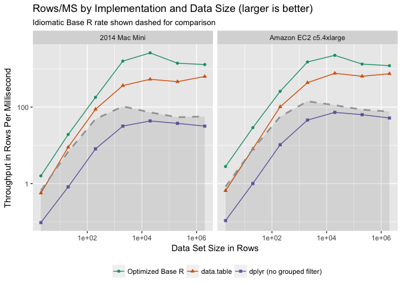
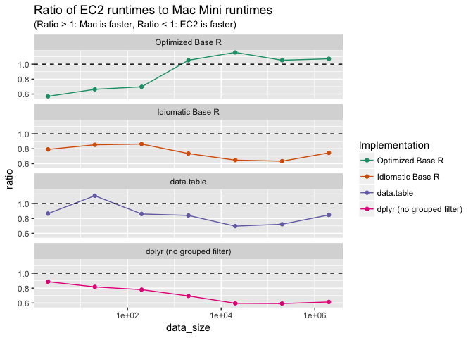

Compare Machine Runs
================
Nina Zumel
January 13, 2018

``` r
macruns = readRDS("qtimings.RDS")
ec2runs = readRDS("qtimings3.RDS")

macruns$machine = "2014 Mac Mini"
ec2runs$machine = "Amazon EC2 c5.4xlarge"

runs <- c(
  "base R cframe calculation",
  "base R tabular calculation",
  "data.table in memory",
  "dplyr in memory no grouped filter"
)

implementationPP = c(
  "Optimized Base R",
  "Idiomatic Base R",
  "data.table",
  "dplyr (no grouped filter)"
)

names(implementationPP) = runs

allruns = rbind(macruns, ec2runs) %>%
  filter(expr %in% runs) %>%
  mutate(expr = as.character(expr)) %>%
  mutate(durationMS = time/1e6,
         machine = factor(machine, levels = c("2014 Mac Mini", "Amazon EC2 c5.4xlarge")),
         Implementation = implementationPP[expr])
```

Reproduce original graph

``` r
summaryF = allruns %>% 
  select(-expr, -time) %>%
  group_by(machine, Implementation, data_size) %>%
  summarize(durationMS = mean(durationMS))

filtercol = with(summaryF, Implementation=="Idiomatic Base R")
baselineF = summaryF[filtercol, , drop=FALSE]
compsF = summaryF[!filtercol, , drop=FALSE]

baseline_color = "darkgray"

# control the ordering of the tasks
levels = setdiff(implementationPP, "Idiomatic Base R")
compsF$Implementation = factor(compsF$Implementation, levels=levels)


ggplot(data=compsF, aes(x=data_size, y=data_size/durationMS, 
                        color=Implementation)) +
  geom_point(aes(shape=Implementation)) + geom_line() + 
  geom_line(data=baselineF, 
            aes(x=data_size, y=data_size/durationMS), 
            color=baseline_color, linetype=2, size=1) +
  geom_ribbon(data=baselineF, 
              aes(x=data_size, ymax=data_size/durationMS, ymin=0), 
              color=baseline_color, alpha=0.1, size=0) +
  scale_x_log10() + ylab("Rows Per Millisecond") +
  scale_y_log10() +
  scale_color_brewer(palette="Dark2") + 
  facet_wrap(~machine, ncol=2) + 
  theme(legend.position = "bottom", legend.title=element_blank()) + 
  ggtitle("Rows/MS by Implementation and Data Size (larger is better)",
          subtitle="Idiomatic Base R rate shown dashed for comparison")
```

    ## Warning: Transformation introduced infinite values in continuous y-axis



Look at changes in total run time (EC2:Mac)

``` r
library(tidyr)

summaryWide = spread(summaryF, key = machine, value=durationMS)
summaryWide$ratio = summaryWide[['Amazon EC2 c5.4xlarge']]/summaryWide[['2014 Mac Mini']]
summaryWide$Implementation = with(summaryWide, factor(Implementation, levels = implementationPP))

ggplot(summaryWide, aes(x=data_size, y=ratio, color=Implementation)) + 
  geom_point() + geom_line() + scale_x_log10() + facet_wrap(~Implementation, ncol=1) + 
  geom_hline(yintercept = 1, linetype=2) + 
  scale_color_brewer(palette="Dark2") + 
  ggtitle("Ratio of EC2 runtimes to Mac Mini runtimes",
          subtitle = "(Ratio > 1: Mac is faster, Ratio < 1: EC2 is faster)")
```


