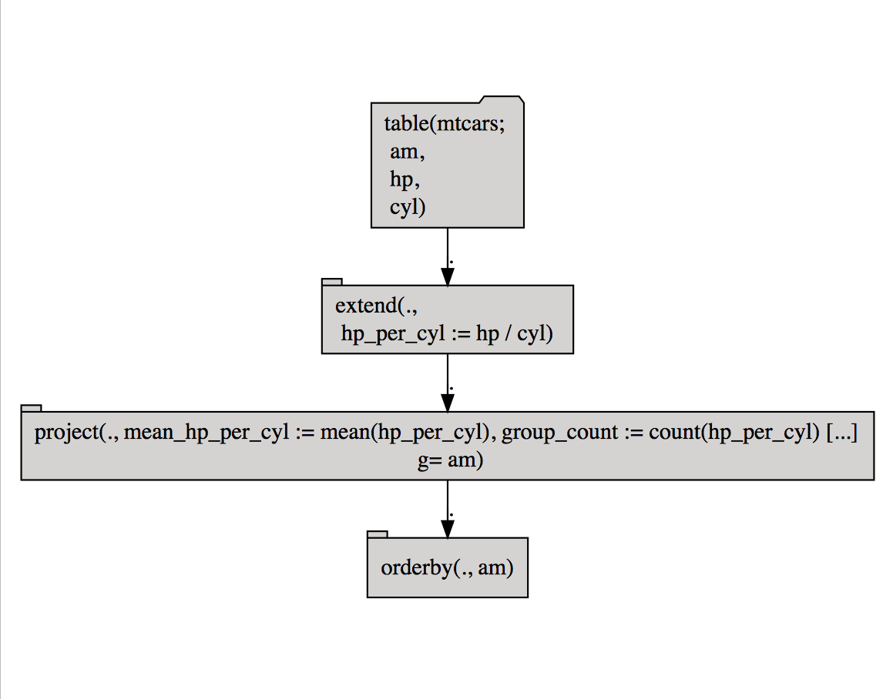

Parameterized Rquery
================

[`rquery`](https://CRAN.R-project.org/package=rquery) `1.2.0` now incorporates [`bquote()`](https://www.rdocumentation.org/packages/base/versions/3.5.1/topics/bquote) [quasi-quotation](https://en.wikipedia.org/wiki/Quasi-quotation).

In fact this is enough to allow `rqdatatable` to directly work the indirect column names example from our `bquote()` articles ([1](http://www.win-vector.com/blog/2018/09/parameterizing-with-bquote/), [2](http://www.win-vector.com/blog/2018/10/quasiquotation-in-r-via-bquote/)).

``` r
library("rquery")
library("rqdatatable")

# define our parameters
# pretend these come from far away
# or as function arguments.
group_nm <- "am"
num_nm <- as.name("hp")
den_nm <- as.name("cyl")
derived_nm <- as.name(paste0(num_nm, "_per_", den_nm))
mean_nm <- as.name(paste0("mean_", derived_nm))
count_nm <- as.name("group_count")
```

Immediate mode example.

``` r
# apply a parameterized pipeline using bquote
mtcars %.>%
  extend(., 
         .(derived_nm) := .(num_nm)/.(den_nm)) %.>%
  project(., 
          .(mean_nm) := mean(.(derived_nm)),
          .(count_nm) := length(.(derived_nm)),
          groupby = group_nm) %.>%
  orderby(., 
          group_nm)
```

    ##    am mean_hp_per_cyl group_count
    ## 1:  0        22.71491          19
    ## 2:  1        23.41987          13

Stored operator tree examples.

``` r
# make an abstract description of the table to start with
td <- mk_td("mtcars",
            as.character(list(group_nm, num_nm, den_nm)))

# helper function to adapt to later database environemnt
count <- function(v) { length(v) }

# capture the operator pipeline
ops <- td %.>%
  extend(., 
         .(derived_nm) := .(num_nm)/.(den_nm)) %.>%
  project(., 
          .(mean_nm) := mean(.(derived_nm)),
          .(count_nm) := count(.(derived_nm)),
          groupby = group_nm) %.>%
  orderby(., 
          group_nm)

# apply it to data
mtcars %.>% ops
```

    ##    am mean_hp_per_cyl group_count
    ## 1:  0        22.71491          19
    ## 2:  1        23.41987          13

We can display the pipeline in various forms.

``` r
# print the operator sequence
cat(format(ops))
```

    ## table(mtcars; 
    ##   am,
    ##   hp,
    ##   cyl) %.>%
    ##  extend(.,
    ##   hp_per_cyl := hp / cyl) %.>%
    ##  project(., mean_hp_per_cyl := mean(hp_per_cyl), group_count := count(hp_per_cyl),
    ##   g= am) %.>%
    ##  orderby(., am)

``` r
# draw the pipeline
ops %.>%
  op_diagram(.) %.>% 
  DiagrammeR::grViz(.)
```



Same example in a database.

``` r
# connect to a database
raw_connection <- DBI::dbConnect(RPostgreSQL::PostgreSQL(),
                           host = 'localhost',
                           port = 5432,
                           user = 'johnmount',
                           password = '')
# build a representation of the database connection
dbopts <- rq_connection_tests(raw_connection)
db <- rquery_db_info(connection = raw_connection,
                     is_dbi = TRUE,
                     connection_options = dbopts)
print(db)
```

    ## [1] "rquery_db_info(PostgreSQLConnection, is_dbi=TRUE, note=\"\")"

``` r
# copy data to db
tr <- rquery::rq_copy_to(db, "mtcars", mtcars, 
                         temporary = TRUE, 
                         overwrite = TRUE)
print(tr)
```

    ## [1] "table(\"mtcars\"; mpg, cyl, disp, hp, drat, wt, qsec, vs, am, gear, carb)"

``` r
# materialize result remotely (without passing through R)
res <- materialize(db, ops)
DBI::dbReadTable(raw_connection, res$table_name)
```

    ##   am mean_hp_per_cyl group_count
    ## 1  0        22.71491          19
    ## 2  1        23.41987          13

``` r
# or execute and pull results back
execute(db, ops)
```

    ##   am mean_hp_per_cyl group_count
    ## 1  0        22.71491          19
    ## 2  1        23.41987          13

``` r
# print the derived sql
sql <- to_sql(ops, db)
cat(sql)
```

    ## SELECT * FROM (
    ##  SELECT "am", avg ( "hp_per_cyl" ) AS "mean_hp_per_cyl", count ( "hp_per_cyl" ) AS "group_count" FROM (
    ##   SELECT
    ##    "am",
    ##    "hp" / "cyl"  AS "hp_per_cyl"
    ##   FROM (
    ##    SELECT
    ##     "am",
    ##     "hp",
    ##     "cyl"
    ##    FROM
    ##     "mtcars"
    ##    ) tsql_33279743848656164628_0000000000
    ##   ) tsql_33279743848656164628_0000000001
    ##  GROUP BY
    ##   "am"
    ## ) tsql_33279743848656164628_0000000002 ORDER BY "am"

``` r
# disconnect
DBI::dbDisconnect(raw_connection)
```

    ## [1] TRUE

``` r
rm(list = c("raw_connection", "db"))
```
