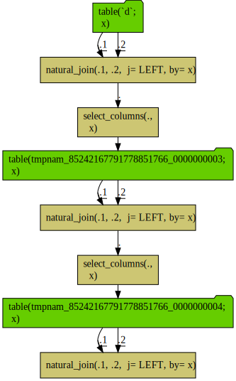

query growth
================

Query sequences joined to themselves blow up the query complexity exponentially, as each path is re-built on each attempted re-use.

``` r
library("rquery")

db <- DBI::dbConnect(RSQLite::SQLite(), ":memory:")

db_rquery <- rquery_db_info(
  connection = db,
  is_dbi = TRUE,
  connection_options = rq_connection_tests(db))
tmps <- wrapr::mk_tmp_name_source()

d <- data.frame(x = -3:3)

d0 <- rq_copy_to(db_rquery, "d", d)

d1 <- natural_join(d0, d0, by = "x", jointype = "LEFT")
d2 <- natural_join(d1, d1, by = "x", jointype = "LEFT")
d3 <- natural_join(d2, d2, by = "x", jointype = "LEFT")

cat(format(d3))
```

    ## table(`d`; 
    ##   x) %.>%
    ##  natural_join(.,
    ##   table(`d`; 
    ##     x),
    ##   j= LEFT, by= x) %.>%
    ##  natural_join(.,
    ##   table(`d`; 
    ##     x) %.>%
    ##    natural_join(.,
    ##     table(`d`; 
    ##       x),
    ##     j= LEFT, by= x),
    ##   j= LEFT, by= x) %.>%
    ##  natural_join(.,
    ##   table(`d`; 
    ##     x) %.>%
    ##    natural_join(.,
    ##     table(`d`; 
    ##       x),
    ##     j= LEFT, by= x) %.>%
    ##    natural_join(.,
    ##     table(`d`; 
    ##       x) %.>%
    ##      natural_join(.,
    ##       table(`d`; 
    ##         x),
    ##       j= LEFT, by= x),
    ##     j= LEFT, by= x),
    ##   j= LEFT, by= x)

Notice the depth 3 expression exploded into tree with 7 joins.

This is not unique to [`rquery`](https://CRAN.R-project.org/package=rquery), [`dplyr`](https://CRAN.R-project.org/package=dplyr) has the same issue.

``` r
library("dplyr")
```

    ## 
    ## Attaching package: 'dplyr'

    ## The following objects are masked from 'package:stats':
    ## 
    ##     filter, lag

    ## The following objects are masked from 'package:base':
    ## 
    ##     intersect, setdiff, setequal, union

``` r
d0_dplyr <- tbl(db, "d")

d1_dplyr <- left_join(d0_dplyr, d0_dplyr, by = "x")
d2_dplyr <- left_join(d1_dplyr, d1_dplyr, by = "x")
d3_dplyr <- left_join(d2_dplyr, d2_dplyr, by = "x")
dbplyr::remote_query(d3_dplyr)
```

    ## <SQL> SELECT `TBL_LEFT`.`x` AS `x`
    ##   FROM (SELECT `TBL_LEFT`.`x` AS `x`
    ##   FROM (SELECT `TBL_LEFT`.`x` AS `x`
    ##   FROM `d` AS `TBL_LEFT`
    ##   LEFT JOIN `d` AS `TBL_RIGHT`
    ##   ON (`TBL_LEFT`.`x` = `TBL_RIGHT`.`x`)
    ## ) AS `TBL_LEFT`
    ##   LEFT JOIN (SELECT `TBL_LEFT`.`x` AS `x`
    ##   FROM `d` AS `TBL_LEFT`
    ##   LEFT JOIN `d` AS `TBL_RIGHT`
    ##   ON (`TBL_LEFT`.`x` = `TBL_RIGHT`.`x`)
    ## ) AS `TBL_RIGHT`
    ##   ON (`TBL_LEFT`.`x` = `TBL_RIGHT`.`x`)
    ## ) AS `TBL_LEFT`
    ##   LEFT JOIN (SELECT `TBL_LEFT`.`x` AS `x`
    ##   FROM (SELECT `TBL_LEFT`.`x` AS `x`
    ##   FROM `d` AS `TBL_LEFT`
    ##   LEFT JOIN `d` AS `TBL_RIGHT`
    ##   ON (`TBL_LEFT`.`x` = `TBL_RIGHT`.`x`)
    ## ) AS `TBL_LEFT`
    ##   LEFT JOIN (SELECT `TBL_LEFT`.`x` AS `x`
    ##   FROM `d` AS `TBL_LEFT`
    ##   LEFT JOIN `d` AS `TBL_RIGHT`
    ##   ON (`TBL_LEFT`.`x` = `TBL_RIGHT`.`x`)
    ## ) AS `TBL_RIGHT`
    ##   ON (`TBL_LEFT`.`x` = `TBL_RIGHT`.`x`)
    ## ) AS `TBL_RIGHT`
    ##   ON (`TBL_LEFT`.`x` = `TBL_RIGHT`.`x`)

Largely it is a lack of a convenient way to name and cache the intermediate results in basic `SQL` without landing a table or view and starting a new query. Without value re-use, re-writing a directed-acyclic graph (the specified input) into a tree (the basis of `SQL`) can cause a query explosion.

`dplyr` can easily overcome this limitation with its `compute()` node.

``` r
d1_dplyr <- compute(left_join(d0_dplyr, d0_dplyr, by = "x"))
d2_dplyr <- compute(left_join(d1_dplyr, d1_dplyr, by = "x"))
d3_dplyr <- compute(left_join(d2_dplyr, d2_dplyr, by = "x"))
dbplyr::remote_query(d3_dplyr)
```

    ## <SQL> SELECT *
    ## FROM `fbiouovcna`

`rquery` can also fix the issue by landing intermediate results, though the table lifetime tracking is intentionally more explicit.

``` r
d1_mat <- materialize(
  db,
  natural_join(d0, d0, by = "x", jointype = "LEFT"),
  table_name = tmps(), temporary = TRUE, overwrite = TRUE)
d2_mat <- materialize(
  db,
  natural_join(d1_mat, d1_mat, by = "x", jointype = "LEFT"),
  table_name = tmps(), temporary = TRUE, overwrite = TRUE)
d3_mat <- materialize(
  db,
  natural_join(d2_mat, d2_mat, by = "x", jointype = "LEFT"),
  table_name = tmps(), temporary = TRUE, overwrite = TRUE)
cat(format(d3_mat))
```

    ## table(`tmpnam_45020507077594676717_0000000002`; 
    ##   x)

And `rquery`'s query diagrammer can help spot and diagnose these issues.

``` r
d3 %.>%
  op_diagram(., merge_tables = TRUE) %.>% 
  DiagrammeR::grViz(.) %.>%
  DiagrammeRsvg::export_svg(.) %.>%
  write(., file="query_growth_diagram.svg")
```

    ## Warning in op_diagram(., merge_tables = TRUE): possible repeated calculation:
    ##  natural_join(.1, .2,  j= LEFT, by= x)


The gold nodes are possibly repeated calculations, and the warning also notes the issue.

One could hope the query optimizer will eliminate the common sub-expressions, but that is not always going to be the case. In fact sometimes the very size of a query turns off the query optimizer in systems such as `Spark`. It is better to organize your calculation to not emit so many common sub-expressions in the first place.

With a more advanced "collector" notation we can both build the efficient query plan, but also the diagram certifying the lack of redundant stages.

``` r
collector <- make_relop_list(tmps)

d1_tab <- natural_join(d0, d0, by = "x", jointype = "LEFT") %.>%
  collector
d2_tab <- natural_join(d1_tab, d1_tab, by = "x", jointype = "LEFT") %.>%
  collector
d3_tab <- natural_join(d2_tab, d2_tab, by = "x", jointype = "LEFT") %.>%
  collector

stages <- get_relop_list_stages(collector)
#stages <- c(stages, list(d3_tab))
cat(format(d3_tab))
```

    ## table(tmpnam_45020507077594676717_0000000005; 
    ##   x)

``` r
stages %.>%
  op_diagram(., merge_tables = TRUE) %.>% 
  DiagrammeR::grViz(.) %.>%
  DiagrammeRsvg::export_svg(.) %.>%
  write(., file="query_growth_diagram2.svg")
```



For a non-trivial example of computation management and value re-use please see [here](https://github.com/WinVector/rquery/blob/master/db_examples/RSQLite.md). Some timings of the query exploding effect are available [here](https://github.com/WinVector/rquery/blob/master/extras/query_growth/time_dag.md) and [here](https://github.com/WinVector/rquery/blob/master/extras/query_growth/time_dag_PostgreSQL.md).

``` r
# clean up tmps
intermediates <- tmps(dumpList = TRUE)
for(ti in intermediates) {
  rquery::rq_remove_table(db, ti)
}

DBI::dbDisconnect(db)
```
